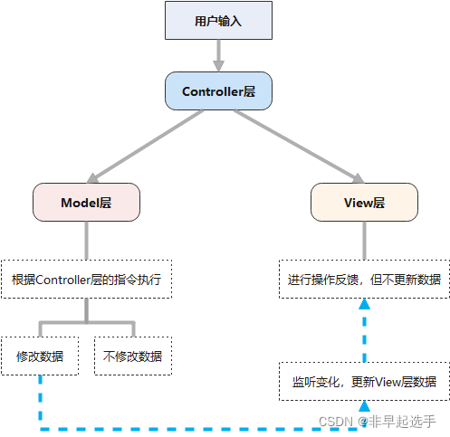
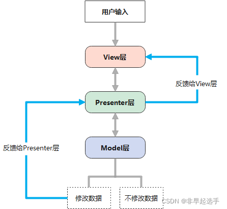
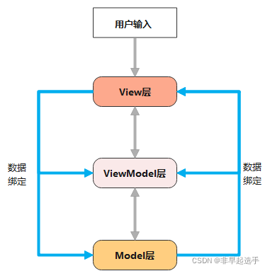

## 16、vue-router 路由模式有几种？

vue-router 有 3 种路由模式：hash、history、abstract，对应的源码如下所示：

```js
switch (mode) {
  case 'history':
	this.history = new HTML5History(this, options.base)
	break
  case 'hash':
	this.history = new HashHistory(this, options.base, this.fallback)
	break
  case 'abstract':
	this.history = new AbstractHistory(this, options.base)
	break
  default:
	if (process.env.NODE_ENV !== 'production') {
	  assert(false, `invalid mode: ${mode}`)
	}
}
```

其中，3 种路由模式的说明如下：

- hash: 默认使用的是哈希模式，在 URL 中会以 # 符号来表示路由,使用 URL hash 值来作路由。优点是兼容性好,支持所有浏览器，包括不支持 HTML5 History Api 的浏览器；
- history : 依赖 HTML5 History API 和服务器配置。去掉了 URL 中的 # 符号。看起来更加美观，但需要服务器配置支持，确保在任何路由下都返回同一个 HTML 页面。具体可以查看 HTML5 History 模式；
- abstract : 抽象模式不直接依赖浏览器的 URL，而是通过自定义的方式进行路由匹配和导航。这种模式主要用于非浏览器环境，比如服务器端渲染（SSR）或者单元测试等场景。支持所有 JavaScript 运行环境，如 Node.js 服务器端。如果发现没有浏览器的 API，路由会自动强制进入这个模式.（只需了解）

## 17、能说下 vue-router 中常用的 hash 和 history 路由模式实现原理吗？

### **（1）hash 模式的实现原理**

早期的前端路由的实现就是基于 location.hash 来模拟路由。其实现原理很简单，location.hash 的值就是 URL 中 # 后面的内容。比如下面这个网站，它的 location.hash 的值为 '#search'。在 hash 模式下，Vue Router 不会向服务器发送请求，而是在客户端中根据 URL 哈希值匹配对应的组件并渲染到页面上。因为 URL 哈希值的变化不会触发浏览器向服务器发送请求的操作，所以在使用 hash 路由模式时页面不会刷新。


### hash 路由模式的实现主要是基于下面几个特性：

- URL 中 hash 值只是客户端的一种状态，也就是说当向服务器端发出请求时，hash 部分不会被发送；
- hash 值的改变，都会在浏览器的访问历史中增加一个记录。因此我们能通过浏览器的回退、前进按钮控制hash 的切换；
- 可以通过 a 标签，并设置 href 属性，当用户点击这个标签后，URL 的 hash 值会发生改变；或者使用  JavaScript 来对 loaction.hash 进行赋值，改变 URL 的 hash 值；
- 我们可以使用 hashchange 事件来监听 hash 值的变化，从而对页面进行跳转（渲染）。
#### 具体实现原理如下：

1. 监听 URL 变化：Vue Router 通过 window.addEventListener('hashchange', listener) 对 URL 哈希值的变化进行监听。一旦 URL 哈希值发生变化，就会触发 listener 回调函数。

2. 更新路由视图：在 listener 回调函数中，Vue Router 会从当前 URL 哈希值中解析出对应的路由路径，并将其传递给 Vue 实例。Vue 实例会根据路由路径匹配对应的组件，并将其渲染到页面上。

3. 修改 URL 哈希值：当用户进行路由跳转时，Vue Router 会通过修改 window.location.hash 的方式改变 URL 哈希值。这会触发浏览器进入新的历史记录状态，并触发 hashchange 事件，进而更新路由视图。

> 需要注意的是，使用 hash 路由模式时需要确保服务器能够正确地响应针对 index.html 文件的请求，并返回正确的内容。因为在 hash 模式下，所有路由的 URL 都指向同一个 HTML 文件（通常是 index.html），而不是每个路由都对应一个单独的 HTML 文件。

### **（2）history 模式的实现原理**

HTML5 提供了 History API 来实现 URL 的变化。其中做最主要的 API 有以下两个：history.pushState() 和 history.repalceState()。这两个 API 可以在不进行刷新的情况下，操作浏览器的历史纪录（history），而不是 URL 哈希值来进行路由导航。唯一不同的是，前者是新增一个历史记录，后者是直接替换当前的历史记录，如下所示：

```js
window.history.pushState(null, null, path);
window.history.replaceState(null, null, path);
```

#### history 路由模式的实现主要基于存在下面几个特性：

- pushState 和 repalceState 两个 API 来操作实现 URL 的变化 ；
- 我们可以使用 popstate 事件来监听 url 的变化，从而对页面进行跳转（渲染）；
- history.pushState() 或 history.replaceState() 不会触发 popstate 事件，这时我们需要手动触发页面跳转（渲染）。

#### 具体实现原理如下：

1. 监听浏览器历史记录的变化：Vue Router 使用 window.addEventListener('popstate', listener) 对浏览器历史记录的变化进行监听。一旦历史记录发生改变，就会触发 listener 回调函数。

2. 更新路由视图：在 listener 回调函数中，Vue Router 会从当前 URL 中解析出对应的路由路径，并将其传递给 Vue 实例。Vue 实例会根据路由路径匹配对应的组件，并将其渲染到页面上。

3. 修改浏览器历史记录：当用户进行路由跳转时，Vue Router 会通过调用 History API 中的 pushState 或 replaceState 方法来修改浏览器的历史记录，并改变当前的 URL。这样就可以使得浏览器在后退（Back）或前进（Forward）操作时能够正确地触发路由的变化，并更新对应的路由视图。

> 需要注意的是，在使用 history 路由模式时需要服务器的支持。因为客户端的 URL 路径会被发送到服务器端，服务器需要配置针对这些 URL 的路由规则，确保在任何时候都返回正确的页面内容。
## 18、什么是 MVVM？
Model–View–ViewModel （MVVM） 是一个软件架构设计模式，由微软 WPF 和 Silverlight 的架构师 Ken Cooper 和 Ted Peters 开发，是一种简化用户界面的事件驱动编程方式。由 John Gossman（同样也是 WPF 和 Silverlight 的架构师）于2005年在他的博客上发表

### MVC
MVC是模型-视图-控制器  



- 逻辑关系  
从上图可以看出，Controller层触发View层时，并不会更新View层中的数据，View层的数据是通过监听Model层数据变化自动更新的，与Controller层无关。换言之，Controller存在的目的是确保M和V的同步，一旦M改变，V应该同步更新。

- 缺点
  - MVC框架大部分逻辑都集中在Controller层，代码量也集中在Controller层，这带给Controller层很大压力，而已经有独立处理事件能力的View层却没有用到；
  - Controller层与View层之间是一一对应的，断绝了View层复用的可能，因而产生了很多冗余代码。
### MVP
MVP是模型-视图-表示器,Model层提供数据，View层负责视图显示，Controller/Presenter层负责逻辑的处理。将Controller改名为Presenter的同时改变了通信方向。

  

- 逻辑  
从上图可以看出，View层和Model层互不干涉，View层也自由了很多，所以View层可以抽离出来做成组件，在复用性上就比MVC框架好很多。

- 缺点
  - 由于View层和Model层都需要经过Presenter层，导致Presenter层比较复杂，维护起来也会有一定的问题；
  - 因为没有绑定数据，所有数据都需要Presenter层进行“手动同步”，代码量较大，虽然比起MVC框架好很多，但还是有比较多冗余部分。
### MVVM
- MVVM是模型-视图-视图模型。

- MVVM与MVP框架区别在于：MVVM采用双向绑定：View的变动，自动反映在ViewModel，反之亦然。

- MVVM 的出现促进了前端开发与后端业务逻辑的分离，极大地提高了前端开发效率，MVVM 的核心是 ViewModel 层，它就像是一个中转站（value converter），负责转换 Model 中的数据对象来让数据变得更容易管理和使用，该层向上与视图层进行双向数据绑定，向下与 Model 层通过接口请求进行数据交互，起呈上启下作用。
  1. （1）View 层
  View 是视图层，也就是用户界面。前端主要由 HTML 和 CSS 来构建 。
  2. （2）Model 层
  Model 是指数据模型，泛指后端进行的各种业务逻辑处理和数据操控，对于前端来说就是后端提供的 api 接口。
  3. （3）ViewModel 层
    - ViewModel 是由前端开发人员组织生成和维护的视图数据层。在这一层，前端开发者对从后端获取的 Model 数据进行转换处理，做二次封装，以生成符合 View 层使用预期的视图数据模型。
    - 需要注意的是 ViewModel 所封装出来的数据模型包括视图的状态和行为两部分，而 Model 层的数据模型是只包含状态的，比如页面的这一块展示什么，而页面加载进来时发生什么，点击这一块发生什么，这一块滚动时发生什么这些都属于视图行为（交互），视图状态和行为都封装在了 ViewModel 里。这样的封装使得 ViewModel 可以完整地去描述 View 层。




#### MVVM框架有大致两个方向：
1. 模型-->视图     ——实现方式：数据绑定
2. 视图-->模型     ——实现方式：DOM事件监听  
存在两个方向都实现的情况，叫做数据的双向绑定。
##### 双向绑定 
MVVM 框架实现了双向绑定，这样 ViewModel 的内容会实时展现在 View 层，前端开发者再也不必低效又麻烦地通过操纵 DOM 去更新视图，  
MVVM 框架已经把最脏最累的一块做好了，我们开发者只需要处理和维护 ViewModel，更新数据视图就会自动得到相应更新。  
这样 View 层展现的不是 Model 层的数据，而是 ViewModel 的数据，由 ViewModel 负责与 Model 层交互，  
这就完全解耦了 View 层和 Model 层，这个解耦是至关重要的，它是前后端分离方案实施的重要一环。

我们以下通过一个 Vue 实例来说明 MVVM 的具体实现，有 Vue 开发经验的同学应该一目了然：

（1）View 层

```js
<div id="app">
    <p>{{message}}</p>
    <button v-on:click="showMessage()">Click me</button>
</div>
```

（2）ViewModel 层

```js
var app = new Vue({
    el: '#app',
    data: {  // 用于描述视图状态   
        message: 'Hello Vue!', 
    },
    methods: {  // 用于描述视图行为  
        showMessage(){
            let vm = this;
            alert(vm.message);
        }
    },
    created(){
        let vm = this;
        // Ajax 获取 Model 层的数据
        ajax({
            url: '/your/server/data/api',
            success(res){
                vm.message = res;
            }
        });
    }
})
```

（3） Model 层

```js
{
    "url": "/your/server/data/api",
    "res": {
        "success": true,
        "name": "IoveC",
        "domain": "www.cnblogs.com"
    }
}
```

##### 数据绑定：
1. 数据劫持
2. 发布-订阅模式
3. 脏值检查

> Vue.js使用的就是数据劫持和发布-订阅模式两种方法

## 19、Vue 是如何实现数据双向绑定的？
### 概念
- Observer：数据监听器，用于监听数据变化，如果数据发生改变，不论是在View层还是在Model层，Observer都会知道，然后告诉Watcher。
- Compiler：指定解析器，用于对数据进行解析，之后绑定指定的事件，在这里主要用于更新视图。
- Watcher：订阅者。
### Vue.js数据绑定的流程：
  1. 首先将需要绑定的数据劫持方法找出来，
  2. 之后用Observer监听这堆数据，如果数据发生变化，Observer就会告诉Watcher，
  3. 然后Watcher会决定让那个Compiler去做出相应的操作，
  这样就完成了数据的双向绑定。
### Vue 数据双向绑定主要是指：数据变化更新视图，视图变化更新数据：


- 输入框内容变化时，Data 中的数据同步变化。即 View => Data 的变化。
- Data 中的数据变化时，文本节点的内容同步变化。即 Data => View 的变化。

其中，View 变化更新 Data ，可以通过事件监听的方式来实现，所以 Vue 的数据双向绑定的工作主要是如何根据 Data 变化更新 View。

### Vue 主要通过以下 4 个步骤来实现数据双向绑定的：

1. 实现一个监听器 Observer：对数据对象进行遍历，包括子属性对象的属性，利用 Object.defineProperty() 对属性都加上 setter 和 getter。这样的话，给这个对象的某个值赋值，就会触发 setter，那么就能监听到了数据变化。

2. 实现一个解析器 Compile：解析 Vue 模板指令，将模板中的变量都替换成数据，然后初始化渲染页面视图，并将每个指令对应的节点绑定更新函数，添加监听数据的订阅者，一旦数据有变动，收到通知，调用更新函数进行数据更新。

3. 实现一个订阅者 Watcher：Watcher 订阅者是 Observer 和 Compile 之间通信的桥梁 ，主要的任务是订阅 Observer 中的属性值变化的消息，当收到属性值变化的消息时，触发解析器 Compile 中对应的更新函数。

4. 实现一个订阅器 Dep：订阅器采用 发布-订阅 设计模式，用来收集订阅者 Watcher，对监听器 Observer 和 订阅者 Watcher 进行统一管理。

> 以上四个步骤的流程图表示如下，如果有同学理解不大清晰的，可以查看作者专门介绍数据双向绑定的文章[《0 到 1 掌握：Vue 核心之数据双向绑定》](https://juejin.im/post/6844903903822086151)，有进行详细的讲解、以及代码 demo 示例。


## 20、Vue 框架怎么实现对象和数组的监听？
### 对属性进行数据劫持Object.defineProperty() 
Vue 使用 Object.defineProperty 方法将对象的属性转换为 getter 和 setter，以便在属性访问和修改时进行拦截
#### 具体步骤如下：

1. 创建 Vue 实例时，将对象作为数据属性传入。
```javascript
var app = new Vue({
  el: '#app',
  data: {
    user: {
      name: 'John',
      age: 25
    }
  }
})
```
2. 在模板中使用该对象的属性。
```html
<div id="app">
  <p>Name: {{ user.name }}</p>
  <p>Age: {{ user.age }}</p>
</div>
```
3. 当访问和修改对象的属性时，Vue 会自动进行拦截并触发相应的更新。
```js
// 访问属性
console.log(app.user.name); // 自动触发更新

// 修改属性
app.user.age = 30; // 自动触发更新
```
### 对整个 对象 和 数组进行劫持，
Vue 使用了重写数组的变异方法（mutation methods），如 push、pop、splice 等，以便在修改数组时能够被监听到。当调用这些变异方法时，Vue 会拦截它们并触发相应的更新。

#### 具体步骤如下：

1. 创建 Vue 实例时，将数组作为数据属性传入。
```javascript
var app = new Vue({
  el: '#app',
  data: {
    items: ['apple', 'banana', 'orange']
  }
})
```
2. 在模板中使用数组的元素。
```html
<div id="app">
  <ul>
    <li v-for="item in items">{{ item }}</li>
  </ul>
</div>
```
3. 修改数组时，使用重写的变异方法，这样就能够被监听到并触发更新。
```javascript
// 修改数组
app.items.push('grape'); // 自动触发更新
```
需要注意的是，直接通过索引修改数组的元素，并不能触发更新。例如，app.items[0] = 'pear' 并不会触发更新。为了确保能够监听到数组元素的修改，应该使用 Vue 提供的变异方法。
### 对数组
```js
  /**
   * Observe a list of Array items.
   */
  observeArray (items: Array<any>) {
    for (let i = 0, l = items.length; i < l; i++) {
      observe(items[i])  // observe 功能为监测数据的变化
    }
  }

  /**
   * 对属性进行递归遍历
   */
  let childOb = !shallow && observe(val) // observe 功能为监测数据的变化
```

通过以上 Vue 源码部分查看，我们就能知道 Vue 框架是通过遍历数组 和递归遍历对象，从而达到利用 Object.defineProperty() 也能对对象和数组（部分方法的操作）进行监听。

## webpack hsah有几种
在webpack中，哈希（hash）是一种根据文件内容计算的标识符，**用于解决浏览器缓存问题**。当文件内容发生变化时，哈希值也会改变，从而触发浏览器重新下载新的文件。

在webpack中，可以通过不同的配置选项来生成不同类型的哈希,正确地使用哈希值，配置合适的 webpack 插件（例如 HtmlWebpackPlugin）和合理的缓存策略，以确保在文件内容发生变化时能够正确地触发浏览器缓存更新。

### Hash：
使用 [hash] 占位符可以生成整个项目的唯一哈希值，即使只有一个文件发生变化，也会导致所有文件的哈希值都改变。

### ChunkHash：
使用 [chunkhash] 占位符可以根据每个 chunk 的内容生成哈希值。这个哈希值只会受到相应 chunk 影响，如果其他的 chunk 没有发生变化，则它们的哈希值不会改变。

### ContentHash：
使用 [contenthash] 占位符可以基于文件内容生成哈希值。这个哈希值仅由文件内容本身影响，不受文件位置等因素的影响。这意味着同样的文件内容会生成相同的哈希值，不同的文件内容会生成不同的哈希值。

- 这些哈希方式可以应用于不同的场景，具体使用哪种方式取决于你的需求。例如，
  - 如果希望在文件内容发生变化时，只影响发生变化的文件对应的哈希值，可以使用 ChunkHash 或 ContentHash。
  - 如果希望在整个项目文件有任何变化时，都触发所有文件的重新下载，可以使用 Hash。