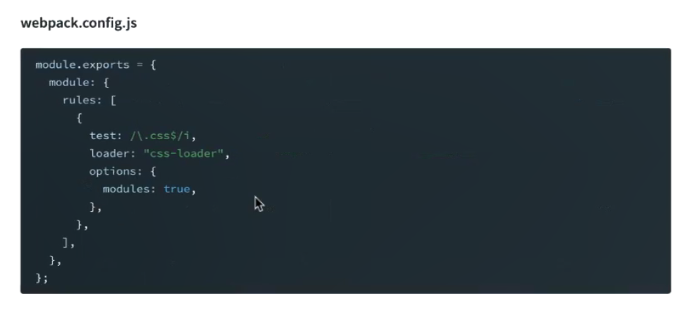
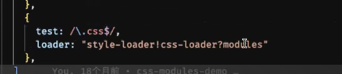

## css模块化
在css中，为了实现这css的模块化，保护变量名，防止冲突。主要有下面两种方法：

- cssModule。
  - 这个方法依然使用css，但是使用js来进行状态管理，能最大化地结合现有 CSS 生态和 JavaScript 模块化能力。
  - 不过可能刚上手写起来可能有点不太习惯   ： [链接](https://www.ruanyifeng.com/blog/2016/06/css_modules.html)
- css in js。使用js或者json格式来书写样式，
  - 优点：实现模块化，增加可移植性，可重⽤性，让样式具有动态功能, 可以将复杂的逻辑应⽤于样式规则。
  - 缺点：几乎无法利用css中特性，比如媒体查询，以及面对hover，active等伪类的处理比较麻烦。
  - 实施：emotion库

### css module
- CSS模块（CSS Modules）是一种在开发中使用的CSS样式模块化解决方案。它通过将CSS样式文件与组件绑定，并使用局部作用域，**将不同模块打包，确保每个组件的样式都是独立而不会相互污染**。

- 使用CSS模块，开发者可以将每个组件的CSS样式封装到一个单独的模块中，这个模块中定义的类名只在当前组件中生效。这样就避免了全局样式的命名冲突和选择器交叉影响的问题。

- **css module 在webpack开启**，在使用CSS模块时，开发者需要将样式文件后缀名命名为.module.css，或者在Webpack等构建工具中进行配置。然后，在组件中引入样式文件时，可以通过导入的方式获取一个对象，其中包含了所定义的类名和样式。在组件的模板中，可以直接使用这些模块化的类名，如styles.className。

- CSS模块的优点之一是它提供了更好的可维护性和可重用性。由于每个组件的样式都被封装在自己的模块中，所以更容易理解和修改。同时，由于样式是局部作用的，可以更方便地复用组件，不用担心样式冲突的问题。

- 另外，CSS模块还支持导入外部样式表和全局样式，可以方便地扩展组件的样式。同时，这些导入的样式仍然遵循局部作用域的规则，不会影响其他组件。

- 使用方法
  - - 新写法 (webpack5新特性)
  
  - - 旧写法 
  

- 总的来说，CSS模块是一种解决CSS样式模块化问题的方法，它通过封装每个组件的样式，并使用局部作用域，提供更好的可维护性、可重用性和样式隔离性。它在现代前端开发中得到了广泛的应用和支持。

### CSS-in-JS 
- 是一种将 CSS 样式直接写入 JavaScript 代码中的方法，通过将样式与组件绑定在一起，实现了更好的组件化和作用域封装。**主要引用于React**。CSS-in-JS 提供了一种在 JavaScript 中编写样式的方式，使得样式依赖关系更加清晰，避免了全局命名冲突和样式泄漏的问题。

#### 使用 CSS-in-JS 的好处包括：

- 组件级别的样式作用域：CSS-in-JS 允许将样式与组件绑定在一起，确保样式只应用于当前组件。这样可以避免全局作用域的样式冲突，并提供更好的样式封装和复用性。

- 动态样式：由于样式直接写在 JavaScript 中，因此可以轻松地根据组件的状态或属性来动态生成样式。这为实现主题切换、条件样式等动态需求提供了便利。

- 组件化开发：CSS-in-JS 推崇将样式与组件打包在一起，促进了组件化开发的理念。通过将样式与组件相关联，开发者可以更方便地理解和维护组件及其样式。

- 更好的开发体验：CSS-in-JS 工具通常提供了强大的开发工具、自动前缀和代码压缩等功能，提供了更好的开发体验和性能优化。

#### CSS-in-JS 的实现方式，主要包括以下常见的库和工具：

- Styled Components：一种流行的 CSS-in-JS 解决方案，使用模板字面量语法来定义样式和组件之间的关系。

- Emotion：另一个受欢迎的 CSS-in-JS 库，通过 JavaScript 对象或模板字面量语法来定义样式。

- JSS（JavaScript Style Sheets）：一种将 CSS 样式转换为 JavaScript 对象的库，通过将样式对象与组件绑定来实现 CSS-in-JS 的效果。

- 总而言之，CSS-in-JS 是一种将 CSS 样式直接写入 JavaScript 中的方法，通过将样式与组件绑定在一起，提供了更好的样式封装和作用域隔离。它促进了组件化开发和动态样式的实现，并通过不同的库和工具提供了灵活的实现方式。