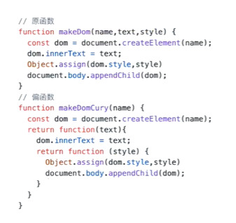
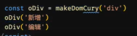

### 普通、箭头、构造

### call\apply\bind

### 变量、函数声明、函数表达式优先级

### 函数节流、防抖

### 闭包

### 高阶函数，作为参数、返回值

### 柯里化函数

### 函数组合 a(b(c(d)))

### lodash

### 函数式编程

运行结果，只依赖输入参数，不依赖外部状态

#### 副作用函数

例如：watchEffect(vue3)

```js
let sum = 10
function add(a) {
  return sum + a
}
add(5)
sum = 20
add(5)
```

#### 纯函数

没有副作用：相同输入，有相同输出
例如：filter

```js
function add(a, b) {
  return a + b
}
```

#### 偏函数

固定一个函数的一些参数，产生一个更小元的函数（多次 return）

  


#### 柯里化

多个参数的函数，转为一个参数的函数（多元，转换为一元），能够实现偏函数生产函数

```js
const curry = (fn) => function fun(...args){
  if(args.length < fn.length){
    // args.length --- > 形参
    // fn.length --- > sum.length --- > 实参
    // 形参 < 实参 --- > 输入的参数不足
    return (..others) => fun(...args.concat(others))
  }
  return fun(...args)
}
function sum (a,b,c,d) {
  return a + b + c + d
}
// curry(sum)
const c = curry(sum)
console.log(c())
console.log(c(1,2,3)(4))
console.log(c(1,2)(3,4))
console.log(c(1,2,3)(4))
console.log(c(1,2,3,4))
```

### vueuse

基于组合式 api 的实用函数集合
