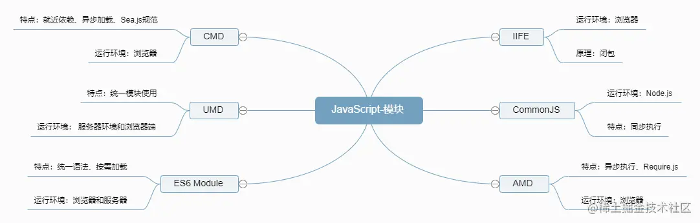

### 模块化 
#### 概念

1. 将 JavaScript 程序拆分为可按需导入的单独模块。每个模块包含特定功能的代码，并且可以在其他模块中引用和复用。  

- 将一个复杂的程序依据一定的规则(规范)封装成几个块(文件), 并进行组合在一起
- 块的内部数据与实现是私有的, 只是向外部暴露一些接口(方法)与外部其它模块通信

2. 常见的JavaScript模块化规范有CommonJS、AMD和ESModule模块化   

**模块化规范**：定义了模块的导入和导出方式，以及模块之间的依赖关系的管理方式  

#### 使用模块化可以带来以下好处：

- 代码组织：将功能相关的代码集中在一个模块中，可以**更好地组织代码结构，提高代码的可读性和可维护性**。
- 代码复用：通过模块化，可以将常用的代码封装在一个模块中，并在不同的项目中**复用，避免重复编写代码**，提高开发效率。
- 避免命名冲突：模块化可以**避免全局命名空间中的变量和函数冲突，每个模块内部作用域是相互隔离的**，可以减少命名冲突的可能性。
- 加载优化：模块化可以**按需加载**，只有在需要时才加载对应的模块，减少不必要的资源加载，提高网页的加载速度和性能。  

####  顺序

   

##### 全局函数
- 编码: 将不同的功能封装成不同的全局函数
- 问题: 污染全局命名空间, 容易引起命名冲突或数据不安全，而且模块成员之间看不出直接关系

##### 对象封装
namespace模式 : 简单对象封装
- 作用: 减少了全局变量，解决命名冲突
- 问题: 数据不安全(外部可以直接修改模块内部的数据)
```js
let myModule = {
  data: 'www.baidu.com',
  foo() {
    console.log(`foo() ${this.data}`)
  },
  bar() {
    console.log(`bar() ${this.data}`)
  }
}
myModule.data = 'other data' //能直接修改模块内部的数据
myModule.foo() // foo() other data
```
##### IIFE

##### CommonJS 规范：
CommonJS 是一个 JavaScript 模块化的规范，最初是为了**解决服务器端 JavaScript 程序的模块化**问题。它定义了一套模块定义、导入和导出的机制，使得 JavaScript 代码能够像其他编程语言（如Java）一样进行模块化开发。

- 暴露模块： module.exports = value或者exports.xx = value(exports 是一个导出的对象)
- 引入模块： require(xx)，如果是第三方模块，xxx 为模块名，如果为自定义模块，xxx 为模块的文件路径。
- 依赖管理：**同步加载模块**（阻塞操作），在运行时动态加载和解析依赖模块。
- CommonJS 规范主要用于服务端编程，加载模块是同步的，适合在运行时动态加载和解析依赖模块的场景。
- 不适合在浏览器环境，因为同步意味着阻塞加载，浏览器资源是异步加载的，因此有了 AMD CMD 解决方案。

#####  AMD 和 RequireJS：
1. 出现原因
- nodejs主要用于服务端变成，服务器的JS是保存在本地磁盘中，加载快，所以commonjs可以是同步的。
- 浏览器环境需要从服务器端加载模块，所有需要实现异步加载。
2. **浏览器环境下使用模块化规范**。
- AMD（**异步模块定义**），允许模块异步加载，而且可以并行加载多个模块，提高了性能和用户体验
- **RequireJS** 是一个实现了 AMD 规范的库，使得在浏览器中使用模块化变得更加方便。
3. 
- 缺点：AMD 规范开发成本高，代码的阅读和书写比较困难，模块定义方式的语义不顺畅。
- 导入方式：使用require函数异步地导入模块。
- 导出方式：使用define函数导出模块。
- 依赖管理：**异步加载模块**，在运行时动态加载和解析依赖模块。
- AMD适用于浏览器端开发，特别适用于需要异步加载模块的场景，例如页面按需加载模块。


#####  UMD 
特点是兼容 AMD 和 CommonJS 规范，而且兼容全局引入。解决了AMD对依赖模块的执行时机的问题
环境： 服务器环境和浏览器端
- UMD 实现原理：
先判断是否支持 AMD（define 是否存在），存在则使用 AMD 方式加载模块；
再判断是否支持 Node.js 模块格式（exports 是否存在），存在则使用 Node.js 模块格式；
前两个都不存在，则将模块公开到全局（window 或 global）

#####  CMD 
- 同AMD规范相同，CMD模块化规范的具体实现需要依赖第三方库，SeaJS 是 CMD 概念的一个实现
- CMD 是 SeaJS 在推广过程中对模块定义的规范化产出，是一个**同步模块**定义
- SeaJS 是淘宝团队提供的一个模块开发的 JS 框架。**什么时候用到什么时候引入，即用即返回**，
- 特点： CMD 是 AMD 在基础上改进的一种规范，和 AMD 不同在于依赖模块的执行机制不同，**CMD 是就近依赖，而 AMD 是前置依赖。**
- 环境： 浏览器环境
- 语法：
导入：define(function(require, exports, module){})
导出：define(function(){return '值'})

#####  ES modules（ES模块）：

ES6可以取代 CommonJS 和 AMD 规范，成为浏览器和服务器通用的模块解决方案。
ES modules 是 ECMAScript（JavaScript）的**官方模块化规范**，它于 ECMAScript 6（ES6）引入，并成为了 JavaScript 的标准特性。ES模块提供了静态导入和导出的语法，使得 JavaScript 开发者能够更加方便地进行模块化开发。
- 特点 ：
**按需加载（编译时加载），异步**
import 和 export 命令只能在模块的顶层，不能在代码块之中（如：if 语句中）,import()语句可以在代码块中实现异步动态按需动态加载
- 环境： 服务器环境和浏览器端
- 语法：
导入：import {modules1,modules1,} from '模块路径'
导出：export或者export default
动态导入：import('模块路径').then(..)
- 依赖管理：静态分析模块，在编译时确定依赖并进行静态导入。
- ES6模块适用于现代浏览器和较新的Node.js版本。它具有静态分析模块的优势，可以进行更好的优化和代码拆分。

#### 服务器 --- node
服务器支持（Node）有两种模式，分别是 ES6 模块和 CommonJS。

从 Node.js v13.2 开始，默认支持 ES6 模块，但是需要采用.mjs为后缀名、或者在package.json中修改type字段为module（推荐）
使用 CommonJS 的话需要以.cjs为后缀，也可以设置package.json中修改type字段为commonjs（推荐）。
