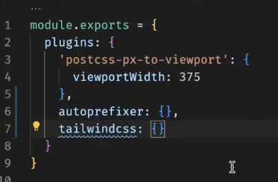
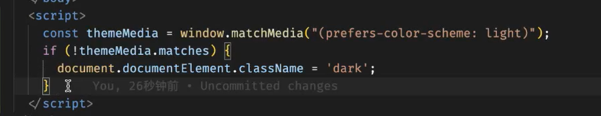
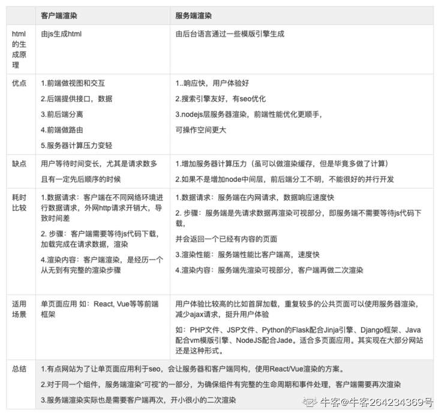

### 1.路由和组件：
#### 路由
路由一般都有新窗口
#### 组件
- 同一个路由内产生的是组件。组件 通过v-show,v-if显示隐藏,
- 使代码看上去更简----使用组件
#### 
* 同一个路由内  ： 相同重复内容可以写成组件，太小的可以不用；
* 点击时，跳转新窗口都是路由（相同时，可以是同一个路由）
* 路由内打开的 是组件

### 2.在路由中，path 参数用于指定页面的路径。在path参数中，写斜杠("/")与不写斜杠的区别如下：

#### 写斜杠 ("/"): path:'/bb' ----> 绝对路由---->/bb

当路径的path参数以斜杠开头时，代表从根路径（即网站的根目录）开始匹配。
通常用于指定网站的顶级路由，如首页或者某个独立页面的路由。

#### 不写斜杠:path:'bb' ----> 相对路由---->/aa/bb ----> redirect:'/bb'

当路径的path参数不以斜杠开头时，代表从当前路径开始匹配。例如，path: 'dashboard' 表示当前路径下的dashboard路径。
通常用于子路由或者嵌套路由。是相对于父路由的路径，用于匹配位于父级路由下特定路径的路由。

#### 总结：

写斜杠 ("/")：表示根路径，从网站的根目录开始匹配。
不写斜杠：表示相对于当前路径的子路径，用于子路由或者嵌套路由的匹配。


### 3.git 提交规范、代码规范
 [git 规范](https://juejin.cn/post/6979515308143263751)


### 4.封装axios时，加入请求和响应拦截
- 请求拦截器
```js
axios.interceptors.request.use(
  config => {
    // 在请求发送前的处理逻辑
    config.headers.Authorization = 'Bearer Token';
    return config;
  },
  error => {
    // 请求错误处理
    return Promise.reject(error);
  }
);
```
-  响应拦截
```js
axios.interceptors.response.use(
  response => {
    // 对响应数据的处理逻辑
    return response;
  },
  error => {
    // 响应错误的处理逻辑
    return Promise.reject(error);
  }
);
```
### 5.使用路由守卫
---
### 6. 密码校验：前瞻 ?=
> /^(?=.*\d)(?=.*[a-z])(?=.=*[A-Z])(?=.*[$@,_.])[\da-zA-Z$@,_.]{6,12}$/
-
  - (?=.*\d) ：只要出现任意数字（\d）
  - [\da-zA-Z$@,_.] ：禁止出现
  - {6,12} ：长度

---
### 7. 使用pnpm install 创建vue3项目

它较npm和Yarn在性能上得到很大提升，被称为快速的，节省磁盘空间的包管理工具，多用于vue3

### 8. postcss 添加 网页前缀
- 在postcss.config.js 中 添加autoprefixer


### 9. 更换主题
- css variable （css变量）
设置root 变量
- 框架：如windicss
根据当前电脑主题颜色，修改项目根节点的类


### 10. 设置count 文件夹
通过变量，管理常量函数名，导出变量

### 11.使用github在线vscode
1. 将com改为dev
2. 在github后加1s

### 12. babel.config.js文件
一个用于配置Babel编译工具的文件。
主要作用是将ECMAScript 2015+ 版本的代码，转换为向后兼容的JS语法，以便能够运行在当前和旧版本的浏览器或其它环境中。
Vue项目中普遍使用ES6语法，若要求兼容低版本浏览器，就需要引入Babel，将ES6转换为ES5。

### 13.网页调试
- 定位到指定样式：ctrl+shift+c
- setTimeout( () => { debugger; },2000 )

### 14.vue this
除了.vue文件，都获取不到this,
都需要导入，例如组件功能

### 15.项目页面业务
每个页面只能完成一个功能，其他功能放到组件或其他页面

### 16.事件方法获取触发事件元素
用$event

### 17.父子传值，可以传递函数，
函数写在methods里，不写在数组里

### 18.函数执行
函数执行时，被放入执行栈，执行完释放，在执行栈中删除。  
**闭包**不会被释放，因为被外部有引用。导致栈溢出，内存泄漏-->使用完后主动释放 或 垃圾回收机制

### 19客户端渲染和服务端渲染
[图片](./img/ccc.png)


### 20.提出问题 ---> 对应解决办法 ---> 实例例子

### 21.